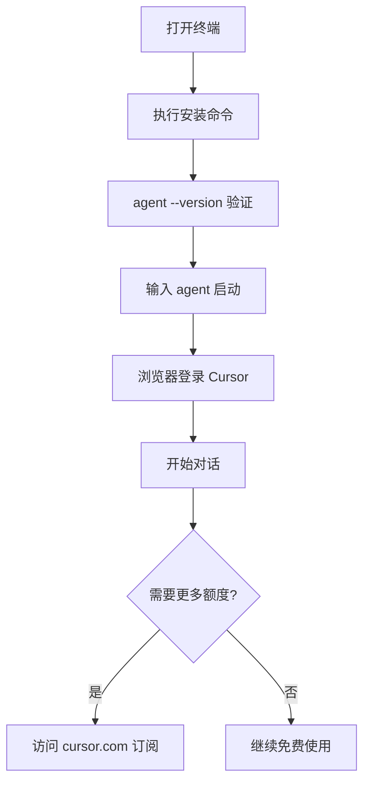

# Cursor CLI 新人使用指南

> 面向零代码经验的市场运营同事，分步骤介绍如何下载、开始使用和付费。

---

## 一、先了解几个概念

| 概念 | 通俗解释 |
|------|----------|
| **终端 / 命令行** | 一个黑色或白色的窗口，用键盘输入文字命令来操作电脑，而不是用鼠标点来点去 |
| **Cursor** | 一款 AI 编程助手，有「桌面软件版」和「命令行版（CLI）」两种使用方式 |
| **Cursor CLI** | 在终端里通过输入命令来使用 Cursor AI，适合做自动化、批处理等任务 |

---

## 二、下载与安装

### 第一步：打开终端

**Mac 用户：**
- 按 `Command + 空格` 打开 Spotlight 搜索
- 输入「终端」或「Terminal」
- 回车打开

**Windows 用户：**
- 按 `Win + R`，输入 `powershell`，回车
- 或：开始菜单 → 搜索「PowerShell」→ 打开

---

### 第二步：执行安装命令

在终端里**复制粘贴**下面这一行，然后按回车：

**Mac / Linux：**
```bash
curl https://cursor.com/install -fsS | bash
```

**Windows（PowerShell）：**
```powershell
irm 'https://cursor.com/install?win32=true' | iex
```

> 安装过程会自动进行，一般 1～2 分钟完成。如果提示需要输入密码，输入你的电脑开机密码（输入时不会显示，是正常的）。

---

### 第三步：验证是否安装成功

在终端输入：
```bash
agent --version
```

如果显示版本号（例如 `1.x.x`），说明安装成功。

**如果提示「找不到命令」：**

Mac 用户需要先配置环境变量，在终端依次执行：
```bash
echo 'export PATH="$HOME/.local/bin:$PATH"' >> ~/.zshrc
source ~/.zshrc
```

然后再试 `agent --version`。

---

## 三、开始使用

### 第一步：登录 Cursor 账号

1. 在终端输入：
   ```bash
   agent
   ```
2. 首次使用会提示你登录，终端里会显示一个链接
3. **复制链接**，在浏览器中打开
4. 用你的 Cursor 账号登录（没有的话需要先注册：https://cursor.com）
5. 登录成功后，终端会显示已连接，就可以开始对话了

---

### 第二步：和 AI 对话

登录后，终端会进入对话模式，你可以直接输入问题，例如：

- 「帮我写一个 Excel 数据汇总的 Python 脚本」
- 「解释一下这段代码在做什么」
- 「帮我整理这份文档的目录结构」

输入后按回车，AI 会回复你。

---

### 第三步：常用命令速查

| 操作 | 命令 |
|------|------|
| 启动对话 | `agent` |
| 直接提问（问完就退出） | `agent -p "你的问题"` |
| 查看历史对话 | `agent ls` |
| 继续上次对话 | `agent resume` |
| 退出对话 | 输入 `exit` 或按 `Ctrl + C` |

---

## 四、付费与订阅

### Cursor 的付费方式

Cursor CLI 和 Cursor 桌面版**共用同一个账号和订阅**，不需要单独付费。

| 方案 | 价格 | 适合人群 |
|------|------|----------|
| **Hobby（免费）** | ￥0 | 轻度使用，有次数限制 |
| **Pro** | 约 $20/月 | 日常使用，基础额度 |
| **Pro+** | 约 $60/月 | 重度使用，额度更高 |
| **Teams** | 约 $40/人/月 | 团队协作，统一管理 |

> 具体价格以官网为准：https://cursor.com/pricing

---

### 如何付费

1. 打开浏览器，访问：**https://cursor.com**
2. 登录你的 Cursor 账号
3. 点击右上角头像 → **Settings**（设置）→ **Subscription**（订阅）
4. 选择需要的方案（Pro / Pro+ / Teams）
5. 按提示绑定信用卡完成支付

**年付可享约 20% 折扣。**

---

### 免费版能用 CLI 吗？

可以。免费版（Hobby）可以使用 Cursor CLI，但：
- Agent 请求次数有限制
- 高级模型（如 Claude、GPT-4）可能无法使用或额度很少
- 如需稳定、大量使用，建议升级到 Pro 或 Pro+

---

## 五、常见问题

**Q：终端里输入中文会乱码怎么办？**  
A：一般 Mac 和 Windows 11 默认支持中文。如仍有问题，可尝试在终端设置里把编码改为 UTF-8。

**Q：安装时提示「权限不足」？**  
A：Windows 需以**管理员身份**运行 PowerShell；Mac 需输入电脑密码授权。

**Q：CLI 和桌面版 Cursor 有什么区别？**  
A：桌面版是图形界面，适合写代码、改文件；CLI 在终端里用命令操作，适合自动化、脚本、CI/CD 等。两者共用同一账号。

**Q：公司可以统一采购吗？**  
A：可以。选择 **Teams** 或 **Enterprise** 方案，联系 Cursor 销售：https://cursor.com/contact-sales

---

## 六、快速上手流程图



---

*文档更新日期：2025 年 3 月*
